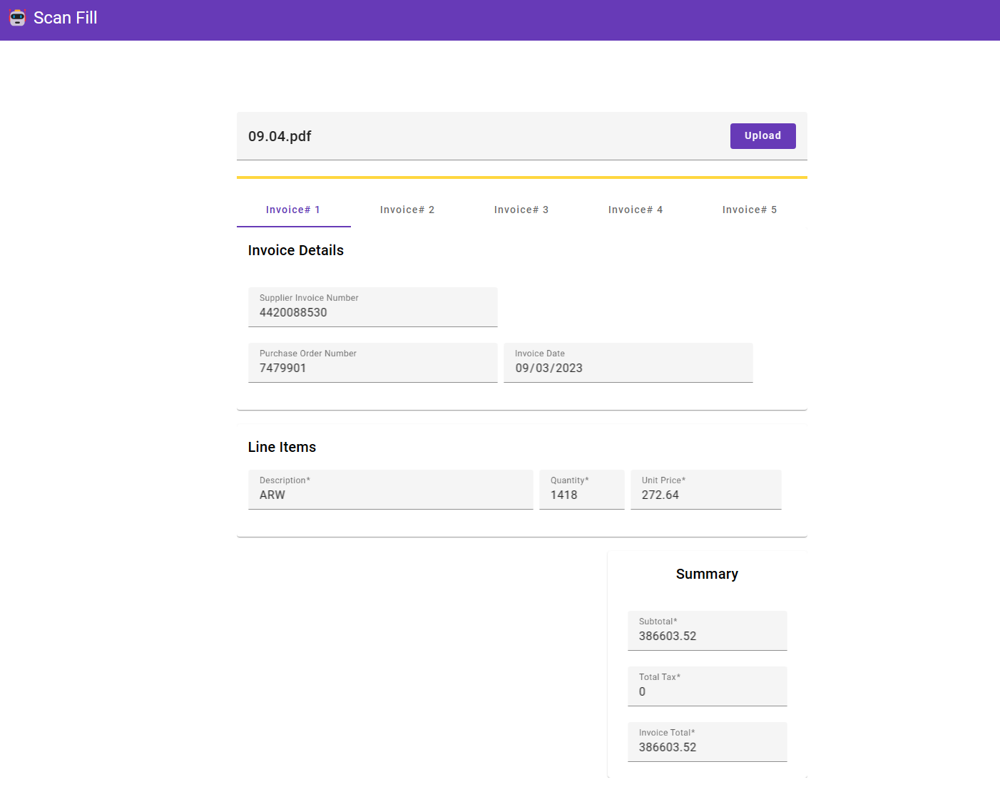

# Scan Fill
## Description
This project is designed to simplify the process of invoice data extraction. Users can upload a PDF invoice, and the application will utilize Azure Document Intelligent Service to scan the document. The scanned invoice data is then displayed.

## Usage
### Prerequisites
- [Install Angular](https://angular.io/guide/setup-local)
- [Install Function Core Tools](https://learn.microsoft.com/en-us/azure/azure-functions/functions-run-local?tabs=windows%2Cisolated-process%2Cnode-v4%2Cpython-v2%2Chttp-trigger%2Ccontainer-apps&pivots=programming-language-csharp#install-the-azure-functions-core-tools)

### Running UI Angular Application
1. Navigate to the `ui` folder 
2. run `npm install` to install dependencies
3. run `ng serve` to start the application

### Running Azure Function
1. navigate to the `api` folder
2. run `az login` to login to Azure and select the subscription you want to use (for Managed Identity)
3. run `dotnet build` to build the project
4. run `func start --csharp` to start the function

## Demo

